<p align='center'>
  
</p>


# Over-the-wire [](https://github.com/vaguue/over-the-wire/blob/main/LICENSE) [](https://www.npmjs.com/package/over-the-wire) 

*The project is currently under active development.*

## Overview
`over-the-wire` is a Node.js packet manipulation library supporting:
- Packet crafting and parsing
- Capturing network traffic and sending packets in all formats
- Parsing and serializing pcap and pcapng file formats
- Creating custom non-TCP/UDP socket instances

## System Requirements
- Libpcap/WinPcap/Npcap library installed (if Wireshark is installed on your system, you are good to go)
- Node.js version 16.10.0 or higher recommended
- C++ compiler, if there are no prebuilt bindings for your system

## Installation

```bash
npm install over-the-wire --save
```

## Getting started
This program demonstrates the library's API capabilities by performing a practical network task: it identifies the default gateway and sends ICMP echo requests (pings) to it, while capturing all network traffic in a pcap file for analysis.
```javascript
const os = require('node:os');
const fs = require('node:fs');

const otw = require('over-the-wire');

async function pingGateway(iface, ifaceData) {
  const { Pcap, Packet } = otw;

  // Listen for all ICMP requests
  const dev = new Pcap.LiveDevice({
    iface,
    direction: 'inout',
    filter: 'icmp',
  });

  // Get info about interface
  console.log('[*] Using interface: ', dev.iface);

  // Save captured packets to a pcapng file
  const dump = Pcap.createWriteStream({ format: 'pcapng' });
  dump.pipe(fs.createWriteStream('dump.pcapng'));

  // Print packet info
  dev.on('data', pkt => {
    if (pkt.layers.IPv4) {
      console.log(`[*] ${pkt.layers.IPv4.src} -> ${pkt.layers.IPv4.dst} (${pkt.layers.ICMP.type})`);
    }
    dump.write(pkt);
  });

  // ARP and Routing tables
  const [arpTable, routingTable] = await Promise.all([
    otw.system.getArpTable(),
    otw.system.getRoutingTable(),
  ])
    .then(res => res.map(e => e[iface]))
  ;
  
  const myIp = ifaceData.address;
  const gatewayIp = routingTable.find(e => e.destination == 'default').gateway;
  const gatewayMac = arpTable.find(e => e.ipAddr == gatewayIp).hwAddr;

  let sequence = 1;

  setInterval(() => {
    // Create and inject a packet
    const pkt = new Packet({ iface: dev.iface })
                    .Ethernet({ dst: gatewayMac })
                    .IPv4({ src: myIp, dst: gatewayIp })
                    .ICMP({ 
                      type: 8,
                      code: 0,
                      id: Math.floor(Math.random() * 65535),
                      sequence,
                    });
    dev.write(pkt);

    sequence++;
  }, 1e3);
}

// Using Node.js to get the default gateway
const [[iface, [data]]] = Object.entries(os.networkInterfaces())
  .map(e => [e[0], e[1].filter(e => e.family == 'IPv4' && !e.internal)])
  .filter(e => e[1].length > 0)
;

pingGateway(iface, data).catch(console.error);
```

## Documentation

[Here :)](https://vaguue.github.io/over-the-wire)

## Questions or Suggestions
Feel free to open any issue in the Issues section of this repository. Currently, there are no restrictions on the format.
